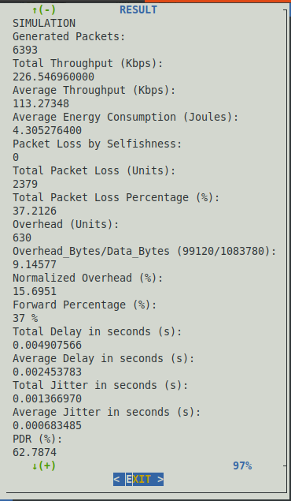

# Performance-Network-Metrics-NS-2
 
  * Name: "Performance-Network-Metrics-NS-2". Script to extract performance metrics from NS-2 traces, such as throughput, energy consumption, packet loss rate (selfish nodes too), routing overhead, packet forwarding rate, end-to-end delay, jitter, and packet delivery rate.                                           
  
  *   Copyright (C) 2013 by Diógenes Antônio Marque José dioxfile@unemat.br.                                            
  *   UNEMAT Brazil, Barra do Bugres Campus: bbg.unemat.br.                 
  *   This program is free software; you can redistribute it and/or modify it under the terms of the GNU General Public License as published by the Free Software Foundation; either version 3 of the License or (at your option) any later version.                               
 
  *   This program is distributed in the hope that it will be useful,  but WITHOUT ANY WARRANTY; without even the implied warranty of MERCHANTABILITY or FITNESS FOR A IPICULAR PURPOSE.  See the GNU General Public License for more details.                          
  
  *   You should have received a copy of the GNU General Public License along with this program; If not, see <http://www.gnu.org/licenses/>.

  Script to extract performance metrics from NS-2 traces, such as throughput, energy consumption, packet loss rate (e.g., selfish nodes too, but you should create a packet dropping event by selfishness in NS-2 as 'SEL'), routing overhead, packet forwarding rate, end-to-end delay, jitter, and packet delivery rate.
  Developed by Diógenes Antônio Marques José from Mato Grosso State University (UNEMAT) - Barra do Bugres - MT, BRAZIL for extract performance metrics from NS-2 MANETs Trace File (e.g., only old trace format).

Usage: 

```user@terminal:$ sudo ./Metrics_Performance_Extractor.sh <FILE.tr> <PACKET_SIZE> <NODE_N>```
# OBS: 
    a) <FILE.tr>: trace file.
    b) <PACKET_SIZE>: packet size in bytes plus 20 bytes extra (e.g., will be explained below).
    c) <NODE_N>: node quantity in the simulation.
    d) Decimal places in Brazil use ',' instead '.'. 
    e) This script runs only on Linux Systems. To run on Windows it must be severely adapted.


  
  The script takes as a parameter three arguments which are: <FILE.tr> (e.g., Trace File); <PACKET_SIZE>, packet size plus 20 bytes extra (e.g., will be explained below); and <NODE_N> (e.g., number of nodes in the simulation). Thus, after the script is executed eight folders are created, for example, Throughput/, Energy/, Packet_Loss/, Overhead/, Forward/, Delay/, Jitter/, and PDR/. All folders contain many files that can be used for simulation analysis. In addition, it is necessary to change parameters in the script according to the simulation to be performed, for example, packet size, nodes numbers, or a new routing protocol.
  
 How do I test this script?
 
 Step 1 - Download Metrics_Performance_Extractor.sh and TRACE_File_DSDV.tr, and put them in the same directory/folder (if possible).
 Step 2 - Install dialog (not substantial) and gawk/awk (substantial). Ex. command on shell Linux:
 
 ``` sudo apt install dialog gawk```
 
 Step 3 - Execute permission to script with the following command shell Linux: 
 
  ```sudo chmod +x Metrics_Performance_Extractor.sh```
 
 Step 4 - Run the script: Ex. command on shell Linux:
 
 ```sudo ./Metrics_Performance_Extractor.sh TRACE_File_DSDV.tr 520 50```
 
 
# How can I use this script in my NS-2 simulations?

Step 1 - Download the script (e.g., Metrics_Performance_Extractor.sh) and open it with your preferred editor and change the parameters according to your needs, for instance: 
 
 a) ```user@terminal:$ sudo ./Metrics_Performance_Extractor.sh <FILE.tr> <PACKET_SIZE> <NODE_N>```.
 b) Packet size for throughput calculation line 51 (e.g., ($8==$PACKET_SIZE)) is used because in the destination application layer (e.g., 'AGT') 20 more bytes are added and they should not be included in the throughput calculation. For example: ```r 59.996499045 _16_ AGT  --- 9223 cbr 270 13a 10 31 800 energy 92.187329 ei 0.000 es 0.000 et 2.230 er 5.583 ------- 49 0 16 0 31 16 3197 1 1```, in this trace file snippet the packet received by node 16 has 270 Bytes (e.g., the field eight = 270). However, the original size is 250 Bytes, the additional 20 bytes were inserted by the application layer. 

Step 2 - Install dialog (not substantial) and gawk/awk (substantial). Ex. command on shell Linux:

```sudo apt install dialog gawk```
 
Step 3 - Execute permission to script with the following command: 

```sudo chmod +x Metrics_Performance_Extractor.sh```
 
Step 4 - Run the script on shell Linux (ex. dash, bash, sh, etc.): Ex. 

```user@terminal:$ sudo ./Metrics_Performance_Extractor.sh <FILE.tr> <PACKET_SIZE> <NODE_N>```
 

OBS: This script was only used with CBR Application and UDP Traffic, but it can be adapted to FTP Application and TCP Traffic easily.
  
